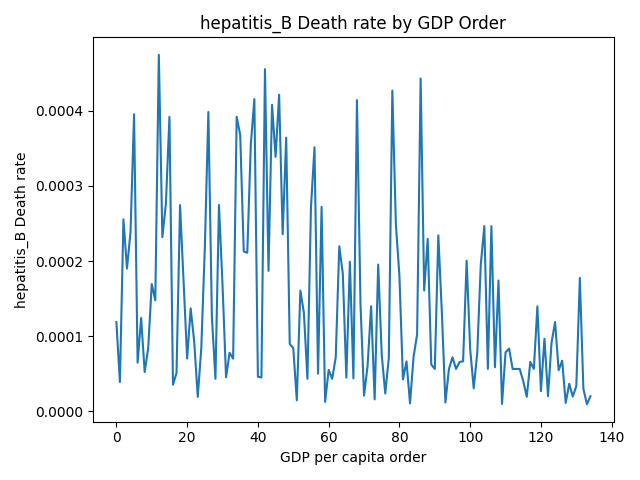

# Štatistická práca
## Získanie dát
Všetok kód na získanie dát sa nachádza v [data_download.py](./data_download.py)
### Úmrtia na choroby
Dáta chorôb som získal z World Health Organization, špecificky tento API [https://www.who.int/data/gho/info/gho-odata-api](https://www.who.int/data/gho/info/gho-odata-api).  
Úmrtia na hepatitídu mali len na rok 2022, čiže zvyšné dáta ma budú trápiť len pre 2022.

#### Získanie kóda indikátoru (API endpointu prakticky) z mena
```python
def get_indicator_code(indicator):
    url = f"https://ghoapi.azureedge.net/api/Indicator?$filter=IndicatorName eq '{indicator}'"
    r = requests.get(url)
    if r.status_code != 200:
        return None

    response_json = r.json()
    if 'value' in response_json and len(response_json['value']) > 0 and 'IndicatorCode' in response_json['value'][0]:
        return response_json['value'][0]['IndicatorCode']
    else:
        return None
```
#### Uloženie dát indikátoru do súboru
```python
def store_indicator_data(indicator_code, output_filename):
    url = f"https://ghoapi.azureedge.net/api/{indicator_code}"
    r = requests.get(url)
    if r.status_code != 200:
        return None

    with open(output_filename, 'w') as json_file:
        json_file.write(r.text)
```

#### Uloženie všetkých potrebných indikátorov
```python
indicators = {
    "tuberculosis_deaths": "Number of deaths due to tuberculosis, excluding HIV",
    "hepatitis_B_deaths": "Deaths caused by chronic hepatitis B (HBV) infection (number)",
    "hepatitis_C_deaths": "Deaths caused by chronic hepatitis C (HCV) infection (number)"
}
def store_indicators():
    for name, indicator in indicators.items():
        indicator_code = get_indicator_code(indicator)
        if indicator_code is not None:
            filename = f"data/{name}.json"
            store_indicator_data(indicator_code, filename)
        else:
            print(f"failed to get indicator code for {indicator}")
        sleep(0.1) # ak tam je nejaký rate limit na api
```

Následne mám dáta o úmrtiach uložené v priečinku **data** ako tuberculosis_deaths.json, hepatitis_B_deaths.json a hepatitis_C_deaths.json.  

### GDP per capita a počet obyvateľov krajín
Tieto dáta som si stiahol z [https://data.worldbank.org/](https://data.worldbank.org/) ako .csv uložil v priečinku **data** ako gdp_pcap.csv a population.csv
***
## Spracovanie dát
Všetok kód na spracovanie dát do finálneho dataframu sa nachádza v [dataframe_generation.py](./dataframe_generation.py)  
Najprv vytvorím z dát dataframes na gdp pre každú krajinu a potom pre úmrtia pre chorobu na každú krajinu a spojím ich dokopy.  


### GDP per capita
```python
def gdp_df():
    df = pandas.read_csv("data/gdp_pcap.csv")[["Country Code", "2022"]]
    df.rename(columns={"2022": "GDP"}, inplace=True)
    df = df.dropna(subset=["GDP"])
    return df
```
### Úmrtia
```python
def country_populations():
    df = pandas.read_csv("data/population.csv")[["Country Code", "2022"]]
    df.rename(columns={"2022": "Population"}, inplace=True)
    df = df.dropna(subset=["Population"])
    return df.set_index('Country Code')['Population'].to_dict()

def death_rate_df(disease):
    populations = country_populations()
    with open(f"data/{disease}_deaths.json", 'r') as file:
        deaths_data = json.load(file)

    death_rate_list = []
    for death in deaths_data["value"]:
        year = death["TimeDim"]
        country = death["SpatialDim"]
        death_count = death["NumericValue"]

        if year != 2022 or country not in populations:
            continue

        death_rate = death_count / populations[country]

        death_rate_list.append({
            "Country Code": country,
            f"{disease}": death_rate
        })

    df = pandas.DataFrame(death_rate_list, columns=["Country Code", f"{disease}"])
    return df
```
### Finálny dataframe
```python
def gdp_and_death_rate_df():
    main_df = gdp_df()
    for disease in ["tuberculosis", "hepatitis_B", "hepatitis_C"]:
        df = death_rate_df(disease)
        main_df = pandas.merge(main_df, df, on="Country Code", how="left")

    return main_df
```

Výsledný dataframe vyzerá nasledovne:   
Niektoré krajiny nemajú dáta ohľadom chorôb a v dátach s gdp sú country codes nie len pre krajiny ale napr. aj pre kontinenty s čím je tiež potrebné rátať.  

***
## Analýza dát

Všetok kód na analýzu dát sa nachádza v [data_analysis.py](./data_analysis.py).

## Miera úmrtí na tuberkulózu s porovnaním s GDP per capita
**H0** - Nulová hypotéza je, že neexistuje korelácia medzi mierou úmrtnosti na tuberkulózu a GDP per capita  
**H1** - Nulová hypotéza je, že existuje korelácia medzi mierou úmrtnosti na tuberkulózu a GDP per capita

Na zistenie toho, či existuje nejaká korelácia medzi mierou úmrtí na dané choroby a GDP per capita použijem Pearsonov korelačný koeficient ktorý mi určí mieru lineárneho vzťahu medzi nimi.

hladinu významnosti použijem 0.05


### Kód
```python
def pearson_correlation(disease):
    df = base_df.dropna(subset=['GDP', disease])
    corr, p_value = stats.pearsonr(df['GDP'], df[disease])

    n = len(df)
    t = corr * math.sqrt(n - 2) / math.sqrt(1 - corr ** 2)
    critical_value = stats.t.ppf(1 - 0.025, n - 2)

    print(f"Pearsonov korelačný koeficient: {corr}")
    print(f"P-hodnota: {p_value}")
    print(f"Testová statistika t: {t}")
    print(f"Kritická hodnota t (dvojstranný test): {critical_value}")
```

### Výsledok
```
Tuberculosis:
Pearsonov korelačný koeficient: -0.05496085552305478
P-hodnota: 0.4525670299736609
Testová statistika t: -0.7527161185204676
Kritická hodnota t (dvojstranný test): 1.9727310334056902
```

### Uzáver
Korelačný koeficient je síce správne negatívny (viacej peniaz -> menej smrtí) ale je veľmi malý, čiže nie je štatisticky významný.  
P-hodnota je príliš veľká a teda nemôžeme zamietnuť nulovú hypotézu.  
Testová štatistika t sa nenachádza v kritickom obore (-1.9 < -0.75 < 1.9).  
Z toho vyplýva, že neexistuje štatisticky významná korelácia medzi mierou úmrtnosti na tuberkulózu a gdp per capita.


## Miera úmrtí na hepatitis B/C s porovnaním s GDP per capita
Použil som rovnaké predpoklady a kód ako s tuberkulózou

### Výsledok
```
Hepatitis B:
Pearsonov korelačný koeficient: -0.26099330361280265
P-hodnota: 0.0012088776803803384
Testová statistika t: -3.3002126287856344
Kritická hodnota t (dvojstranný test): 1.976013177679155

Hepatitis C:
Pearsonov korelačný koeficient: -0.07164677714315626
P-hodnota: 0.38040138948297514
Testová statistika t: -0.8797511296988669
Kritická hodnota t (dvojstranný test): 1.9759053308869137
```

### Uzáver Hepatitis B
Korelačný koeficient je štatisticky významný, aj keď nie príliš silný, negatívny lineárny vzťah medzi gdp per capita a úmrtnosťou na hepatitis B.  
P-hodnota je výrazne menšia než 0.05 a teda je výsledok štatisticky významný.  
Testová štatistika t sa nachádza v kritickom obore (-3.3 < -1.9).  
Z toho vyplýva, že existuje štatisticky významná negatívna korelácia medzi mierou úmrtnosti na Hepatitis B a gdp per capita.

### Uzáver Hepatitis C
Korelačný koeficient je veľmi malý, čiže nie je až tak štatisticky významný.  
P-hodnota je príliš veľká a teda nemôžeme zamietnuť nulovú hypotézu.  
Testová štatistika t sa nenachádza v kritickom obore (-1.9 < -0.8 < 1.9).  
Z toho vyplýva, že neexistuje štatisticky významná korelácia medzi mierou úmrtnosti na Hepatitis C a gdp per capita.

## Porovnanie chorôb
Stačí sa pozrieť na korelačný koeficient z ktorého plynie, že GDP per capita a úmrtnosť na hepatitis B majú významný negatívny lineárny vzťah, zatiaľ čo Hepatitis C má slabý, nevýznamný vzťah a tuberkulóza má ešte slabší.  

## Grafy
Rozhodol som sa ešte spraviť zopár grafov ktoré ukážu tieto dáta a trochu ich viacej zkontextualizujú.

### Scatter plot
```python
def disease_gdp_plot(disease):
    df_cleaned = base_df.dropna(subset=['GDP', disease])
    sns.scatterplot(x="GDP", y=disease, data=df_cleaned)

    plt.xscale("log")
    plt.yscale("log")

    plt.xlabel("GDP per capita")
    plt.ylabel(f"{disease} Death rate")
    plt.title(f"{disease} Death rate by GDP per capita")

    plt.tight_layout()
    plt.show()
```
Používam pre x aj y logaritmický scale aby extrémy neovplyvňovali toľko výsledok a aby bolo prehľadne vidieť trendy (či ide úmrtnosť dole s lepším gdp)

  


### Line graph
```python
def disease_gdp_plot(disease):
    def disease_ordered_gdp_plot(disease):
        df_cleaned = base_df.dropna(subset=['GDP', disease])
        lower_bound = df_cleaned[disease].quantile(5 / 100)
        upper_bound = df_cleaned[disease].quantile(95 / 100)
        df_filtered = df_cleaned[(df_cleaned[disease] >= lower_bound) & (df_cleaned[disease] <= upper_bound)]

        df_sorted = df_filtered.sort_values(by='GDP')
        sns.lineplot(x=range(len(df_sorted)), y=df_sorted[disease])

        plt.xlabel('GDP per capita order')
        plt.ylabel(f'{disease} Death rate')
        plt.title(f'{disease} Death rate by GDP Order')

        plt.tight_layout()
        plt.show()
```
Tento line plot nerieši hodnoty gdp len poradia medzi krajinamy a zároveň som odstránil top 5% a bottom 5% kvôli extrémov.  





***
## Záver a diskusia
Nakoniec je vidieť že úmrtnosť na hepatitídu B je zďaľeka najviac ovplyvniteľná tým, aké GDP per capita je v krajine.  
Pôvodne som si myslel, že budú aj tie zvyšné choroby viacej ovplyvnené GDP, čiže musím povedať že som výsledkom prekvapený.  
Dôvodov prečo to tak je mi napadlo viacero, napríklad je možné že sa veľa úmrtí na tieto choroby v chudobnejších krajinách neregistruje.  
Taktiež asi pomáha externá pomoc v rámci charít etc. v chudobnejší krajinách.  
Hepatitída C sa šíri cez krv zatiaľ čo hepatitída B sa šíri aj cez kontakt s telesnými tekutinami, čo je asi jeden z faktorov prečo úmrtí na Hepatitídu B je viacej v chudobnejších krajinách, kde sa asi viacej dokáže rozšíriť.  

Každopádne tento výsledok mi príde celkom zaujímavý a taká daľšia menšia zaujímavosť čo som si všimol je, že top 5 krajín s najviac smrtí na tuberkulózu na 1 človeka sú všetky v Oceánií (Tuvalu, Marshall islands, Nauru, Kiribati, Palau). 